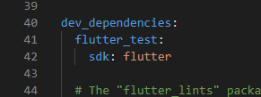
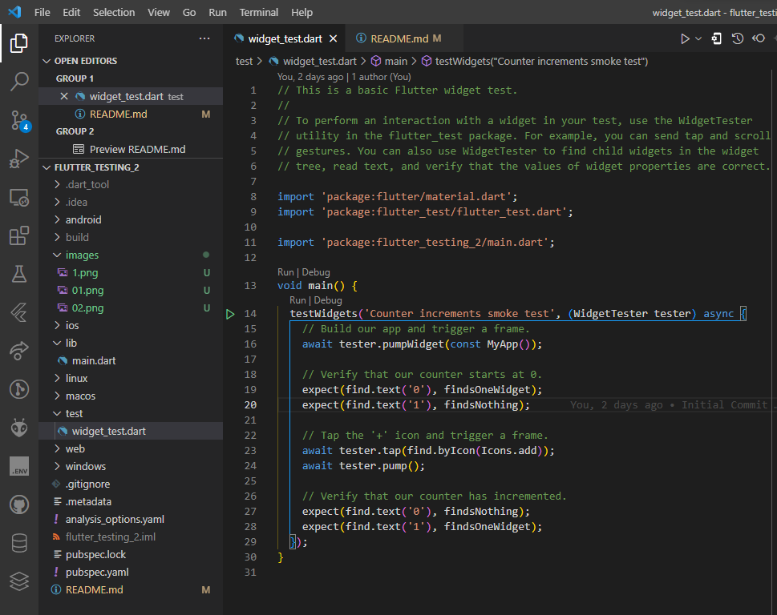
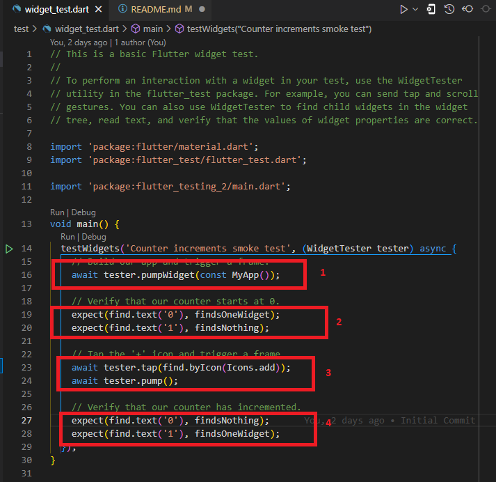
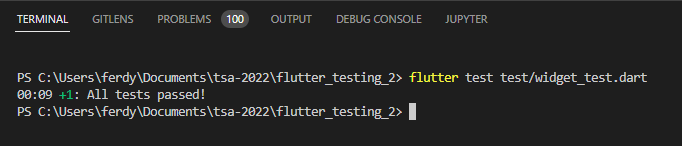
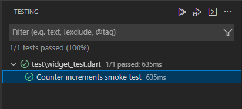
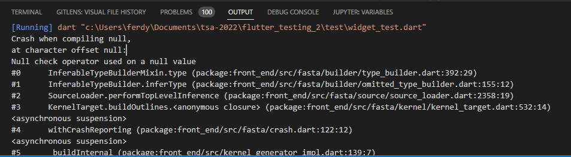
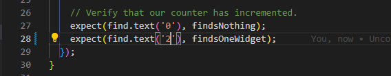
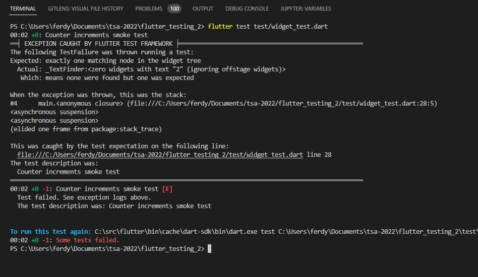
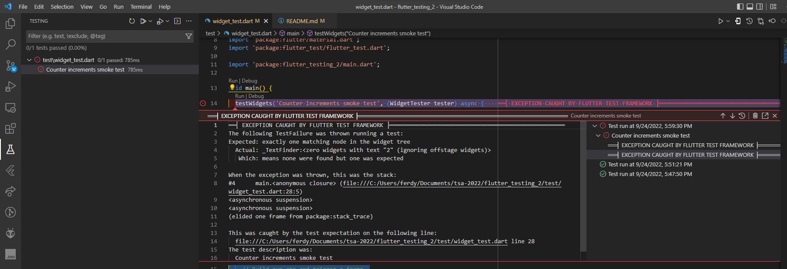

# Unit Testing Bagian 2

## Tujuan

* Mampu menerapkan Widget Testing menggunakan flutter_test 
* Mampu menerapkan Debugging menggunakan tools pendukung

# Widget Testing Menggunakan fluttter_test

## Widget Testing

* Widget testing melakukan pengujian komponen widget secara terisolasi
* Tujuan utama adalah memeriksa hasil interaksi dari tampilan widget apakah telah sesuai dengan harapan apa belum
* Karena tampilan widget disusun terstruktur seperti pohon maka pada pengujian widget diperlukan sebuah framework
* Flutter menyediakan package untuk melakukan pengujian terhadap widget menggunakan flutter_test

## flutter_test Package

* Package flutter_test telah tersedia bersama instalasi Flutter SDK dan berada pada tingkat paling tinggi sebagai test package
* Flutter_test menyediakan kelas WidgetTester untuk membantu pengujian  pada lingkungan struktur widget
* Dianggap sebagai library core karena digunakan oleh Dart untuk package pengujian utama

## Fungsi testWidgets()

* Class WidgetTester diterapkan dengan membuat fungsi testWidgets() sebagai entry point untuk semua pengujian widget pada Flutter
* Fungsi memiliki dua syarat dan dua pilihan parameter:
    1. Description -> parameter wajib yang digunakan untuk menyimpan hasil dari pengujian
    2. Callback -> parameter wajib yang menerapkan pewarisan WidgetTester sehingga bisa beriteraksi dengan widget yang diuji
    3. Skip -> dengan skip dapat melewati pengujian jika dijalankan pengujian multiple
    5. Timeout -> parameter pilihan untuk menyimpan  waktu maksimum callback berjalan

## Persiapan Widget Testing

* Periksa Dependencies dan pastikan flutter_test telah dideklarasikan. Secara default, package flutter_test telah ada bersama Flutter SDK

## Contoh widget_test.dart

* Terdapat contoh file pengujian pada direktori test/, dimana secara default direktori test/ ini sudah terbuat dan di dalamnya terdapat file widget_test.dart untuk menguji aplikasi counter Flutter

    

## Bedah widget_test.dart

* Fungsi testWidgets() dijalankan dengan parameter deskripsi dan menerapkan 
* WidgetTesterCallback dengan modifier async dan nilai kembailian Future
* Yang ingin diuji adalah tampilan widget, dalam contoh ini adalah tampilan yang ada pada MyApp(). Setting ada pada tester.pumpWidget(const MyApp())
* Jika menginginkan menguji widget pada point yang lain, tester.pum() menjadi penting untuk disetting
* Dalam pengujian widget terdapat tiga hal penting meliputi expect(), find, Matcher 

## Expect(), Find, dan Matcher

* Fungsi expect() sama seperti fungsi expect() pada unit testing, penerapannya pada pengujian widget ini menggabungkan kondisi find dan matcher
* Fungsi find erat kaitannya dengan class Finder dimana memungkinkan mencari widget spesifik dalam struktur pohon ttampilan widget
* Fungsi matcher terkait dengan class Matcher berfungsi untuk memabantu memvalidasi temuan karakteristik widget dengan hasilnya 

## widget_test.dart

1. Setting untuk pengujian frame MyApp
2. Menguji apakah teks diawali bernilai 0, jika diawali 1 maka matcher-nya bernilai none. Untuk mencari teks menggunakan find.text(). Sedangkan matcher kondisi ada pada findsOneWidget dan findsNothing

3. Dengan tester.tap() maka widget yang diuji refresh, digantikan dengan pencarian widet sesuai parameter Icons.add. Kemudian Icons.add menjadi yang diuji dengan deklarasi tester.pump()    

4. Jika Icons.add ditekan maka dicari teks bernilai 1 menggunakan find.text(). Jika tetap bernilai 0 maka matcher bernilai findsNothing

## Eksekusi Widget Testing

Running test pada terminal

Running test

Running dart (ctrl + alt + N)

## Widget Testing Gagal

Diubah pada saat ditekan Icon.add bernilai 2 daripada 1 untuk matcher findsOneWidget

Hasil run test
 
 

# Debugging Menggunakan Tools Pendukung

